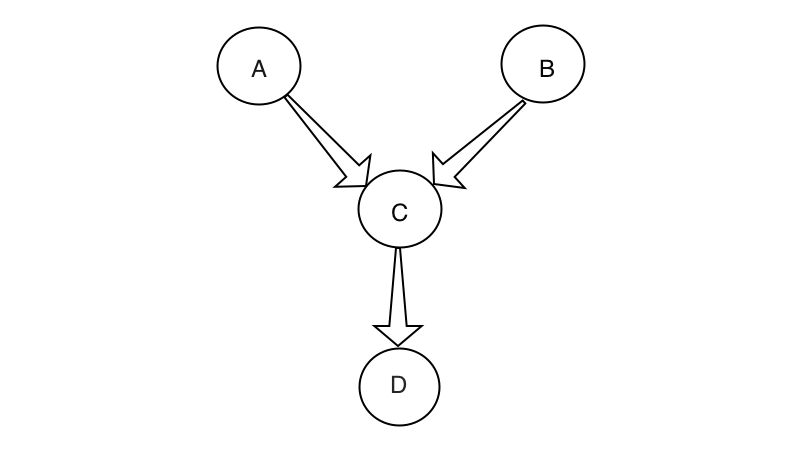

# AssemblyLine


[](https://coveralls.io/github/LeakyBucket/assembly_line?branch=master)
[]()

`AssemblyLine` makes handling complex job processing a painless process that will leave you wondering why you were worried about it in the first place.

[Installation](#installation)
[Configuration](#configuration)  
[Usage](#usage)  

Let's say you have the following simple dependency graph:



The nature of that structure could simply be reflected by the following list:  `[[a, b], c, d]`.  That is to say each element in the outermost list is a requirement for the next element in the list.  If multiple nodes are requirements of another node but not of each other then they can be grouped together in their own list.

In order to process the above graph with `AssemblyLine` you simply need to pass the following structure to a new `Server`.

```
[
  [
    %Job{task: :a, args: [arg1, arg2]},
    %Job{task: :b, args: []}
  ],
  %Job{task: :c, args: [arg1]},
  %Job{task: d, args: []}
]
```

## Installation

[Available in Hex](https://hex.pm/packages/assembly_line/0.5.0), the package can be installed as:

  1. Add assembly_line to your list of dependencies in `mix.exs`:

        def deps do
          [{:assembly_line, "~> 0.5.0"}]
        end

  2. Ensure assembly_line is started before your application:

        def application do
          [applications: [:assembly_line]]
        end

## Configuration

AssemblyLine has a couple of configuration options:

* `check_interval`
* `job_executor`

### check_interval

The `check_interval` is optional and defaults to 1 second.  This governs how often the `Handler` module checks for a response from the `Tasks` it spawns.

The `Handler` will check until all `Tasks` have responded, independent of the `check_interval` however a shorter interval will allow you to update progress information or give other feedback to users more quickly.

### job_executor

The `job_executor` value is required if you do not specify a `worker` on one or more Job structs.  The `Handler` module will call the `perform/1` function on this module for each job that does not have an explicit `worker` setting.

## Usage

There are three main 'pieces':  The `Server`, the `Handler` and the `Job`.

#### The Server  

`next_for/1` - returns the current job set

```
iex> Server.next_for :my_queue
[%Job{task: :a, args: [arg1, arg2]}, %Job{task: :b, args: []}]
```

`get_completed/1` - returns a set of completed jobs for the queue

```
iex> Server.get_completed :my_queue
%MapSet{%Job{task: a, args: [arg1, arg2], result: 200}}
```

`complete_current_set/1` - pops the head off the job list for the queue

```
iex> Server.next_for :my_queue
[%Job{task: :a, args: [arg1, arg2]}, %Job{task: :b, args: []}]

iex> Server.complete_current_set :my_queue
iex> Server.next_for :my_queue
[%Job{task: :c, args: [arg1]}]
```

`complete_job/2` - removes the job definition from the current set in the queue and adds the job to the `finished` list

```
iex> Server.complete_job :my_queue, %Job{task: :a, args: [arg1, arg2], result: 200}
iex> Server.next_for :my_queue
[%Job{task: :b, args: [arg1], result: nil}]

iex> Server.get_completed :my_queue
%MapSet{%Job{task: :a, args: [arg1, arg2], result: 200}}
```

`finished/1` - Shutsdown the job queue

```
iex> Server.finished :my_queue
:ok
```

#### The Handler

`start_all/1` - initiate the processing of a job queue

```
iex> Handler.start_all :my_queue
:finished | {:incomplete, [%Job{},]}
```

`process/2` - processes the queue recursively until a job fails or all jobs finish

```
iex> Handler.process :my_queue, [%Job{}, %Job{}]
:finished | {:incomplete, [%Job{},]}
```

#### The Job

`struct` - holds information about the task, it's parameters and the outcome

```
%Job{task: term, args: list, result: term}
```

`set_result/2` - assigns a value to the result attribute

```
iex> Job.set_result %Job{task: :a, args: [arg1], result: nil}, 200
%Job{task: :a, args: [arg1], result: 200}
``
